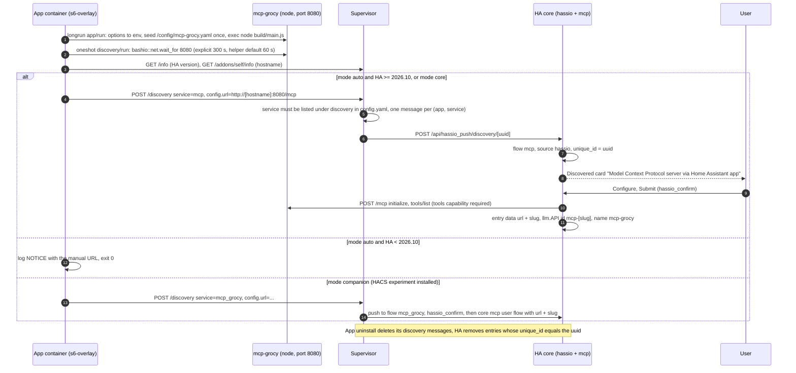

# Home Assistant: App, core `mcp` integration and the HACS question

Design note, 2026-09-28. Home Assistant, Supervisor and HACS facts were checked against the sources listed at the end; version numbers are those of that day.

## Summary

- **Verdict**: "add this MCP as an _App_ through a custom _HACS_ repository" mixes two channels. Since HA 2026.2 "App" is the new name of Supervisor add-ons, and this repository **already is an App** (`config.yaml`, `rootfs/`, `DOCS.md` at the root). HACS does not distribute Apps (FAQ: "HACS does not handle apps"); it only knows Python integrations, dashboards, themes, templates, AppDaemon apps and python_scripts.
- **Good news**: the core _Model Context Protocol_ integration (`mcp`, HA ≥ 2025.2) speaks Streamable HTTP since HA 2026.2 and, since 2026-08-29 on `dev` (PR #180378, expected in HA **2026.10**), discovers an App that announces itself through the Supervisor (`discovery: [mcp]`). **Nothing has to go through HACS** for Grocy to be available in Assist.
- **Bad news**: the App shipped in the repository was neither installable nor functional (missing app repository, image never built, s6 services in the wrong place, `Dockerfile` not copying `rootfs/`, misnamed `response_size_limit` option, no tool enabled, `set -x` logging the API key, outdated `DOCS.md`).
- **What this branch does**: fixes the App, makes it self-announcing (HA ≥ 2026.10) and documents the manual setup (HA 2026.2 – 2026.9). Port 8080 is not published on the host: HA reaches it on the Supervisor's internal network, so **no token**. Without `image:` in `config.yaml` the Supervisor builds the image locally.
- **HACS companion** (`custom_components/mcp_grocy`): kept as an opt-in experiment for what core lacks (one-click on HA 2026.2 – 2026.9, connectivity sensor); no static-token support.
- **Out of scope, next steps**: prebuilt images, TypeScript server changes (query token on POST), tool titles and annotations.

## 1. What "App" and "HACS custom repository" map to

| Term                       | In Home Assistant (2026)                                                                                                                                       | Distributed through                                                                                                                | This repo                                                                                 |
| -------------------------- | -------------------------------------------------------------------------------------------------------------------------------------------------------------- | ---------------------------------------------------------------------------------------------------------------------------------- | ----------------------------------------------------------------------------------------- |
| **App**                    | Supervisor add-on, renamed "App" in HA 2026.2 (UI only: `config.yaml`, Supervisor API, `/addons` endpoints unchanged)                                          | _App repository_: Git repo with `repository.yaml` + one folder per app, added under Settings > Apps > App store > ⋮ > Repositories | Already an App (slug `mcp_grocy_api`), broken until this branch (2.3)                     |
| **HACS custom repository** | Categories: Integration, Dashboard, Theme, Template, AppDaemon, Python script. No "app": "HACS does not handle apps" ([FAQ](https://hacs.xyz/docs/faq/addons)) | HACS > ⋮ > Custom repositories > URL + category                                                                                    | Only a Python `custom_components/<domain>/` can live there; it cannot run the Node server |
| **Underlying goal**        | Grocy tools in Assist / conversation agents with minimal typing                                                                                                | Core `mcp` integration + Supervisor discovery                                                                                      | Achievable with the App alone                                                             |

"App via HACS" is a category mismatch; the deliverable is a working, self-announcing App. A HACS artefact can only be a _companion_, justified only for what core lacks (section 3).

## 2. What works today with the App + core `mcp` integration

### 2.1 Home Assistant side (checked against `home-assistant/core`, 2026-09-28)

| Capability                                                                                                                                                                  | Since                                                                                                                                                                      | Evidence                                            |
| --------------------------------------------------------------------------------------------------------------------------------------------------------------------------- | -------------------------------------------------------------------------------------------------------------------------------------------------------------------------- | --------------------------------------------------- |
| Core `mcp` client (config flow, PyPI `mcp`, `llm.API`)                                                                                                                      | HA 2025.2                                                                                                                                                                  | manifest `mcp==1.28.1` on `dev` (2026.9.4: 1.26.0)  |
| Streamable HTTP first, SSE fallback on 405 / `McpError`, same URL                                                                                                           | HA 2026.2 ([#161547](https://github.com/home-assistant/core/pull/161547), [#162655](https://github.com/home-assistant/core/pull/162655))                                   | `coordinator.py::mcp_client`                        |
| **App discovery**: `async_step_hassio` reads `config["url"]`, `unique_id` = discovery uuid, one-click `hassio_confirm`, entry removed on uninstall, LLM API id `mcp-<slug>` | On `dev` since 2026-08-29 ([#180378](https://github.com/home-assistant/core/pull/180378)); not in 2026.9.4; no `2026.10*` tag on 2026-09-28 → **HA 2026.10** (~2026-10-07) | `config_flow.py`                                    |
| Authentication                                                                                                                                                              | _None_ or OAuth 2.0 only (401 + `WWW-Authenticate` + RFC 9728/8414 metadata); no static token or header field                                                              | `STEP_USER_DATA_SCHEMA = {Required(CONF_URL): str}` |
| Runtime limits                                                                                                                                                              | **10 s** per tool call and per `tools/list`; **new MCP session per call**; tool list refreshed every **30 min**; _Tools_ only                                              | `coordinator.py`                                    |
| Tool annotations                                                                                                                                                            | hints → `llm.ToolAnnotations`; undeclared = destructive + open world                                                                                                       | `_tool_annotations`                                 |
| Naming next to Assist                                                                                                                                                       | `<slugify(api.name)>__<tool>` → `mcp-grocy__inventory_stock_get_all`                                                                                                       | `helpers/llm.py`                                    |

The server already offers what this client needs: `POST /mcp` (Streamable HTTP, `Mcp-Session-Id`), `GET /mcp/sse` + `POST /mcp/messages`, `GET /` health JSON, session-less requests answered `405 Allow: POST`. `SERVER_NAME = mcp-grocy` becomes the HA entry title and the LLM API name. Caveat: https://www.home-assistant.io/integrations/mcp/ (and its `next.` preview) still says "SSE Server URL", recommends `mcp-proxy` and has no app-discovery paragraph — `DOCS.md` must not link to it for the discovery flow yet.

### 2.2 Exact UI steps

1. **Install**: Settings > Apps > App store > ⋮ > Repositories > add `https://github.com/<owner>/mcp-grocy#main` (`#main` follows stable releases; the bare URL tracks the default branch `dev`) > **MCP Grocy API** > Install (local build, minutes) > Configuration: `grocy_base_url`, `grocy_api_key` > Start.
2. **Connect Home Assistant**:

   | HA version           | Steps                                                                                                                                                                 |
   | -------------------- | --------------------------------------------------------------------------------------------------------------------------------------------------------------------- |
   | ≥ 2026.10 (expected) | Settings > Devices & services shows a **Discovered** card "Model Context Protocol server via Home Assistant app" > Configure > Submit. Nothing to type.               |
   | 2026.2 – 2026.9      | Add integration > _Model Context Protocol_ > URL `http://<app-hostname>:8080/mcp`. **Not** `/mcp/sse`: a POST there is a 404 that the client does not retry over SSE. |
   | 2025.2 – 2026.1      | Same with `http://<app-hostname>:8080/mcp/sse` (SSE-only client).                                                                                                     |
   | < 2025.2             | No core client; `mcp-proxy` was the only option (origin of the old `DOCS.md` sentence).                                                                               |

   `<app-hostname>` is on the App's **Info** page and in its log: `<repository-hash>-mcp-grocy-api`, or `local-mcp-grocy-api` when copied into `/addons` (the hash depends on the exact string entered, 5.4).

3. **Hand the tools to an assistant**: Settings > Voice assistants > _assistant_ > conversation agent (Ollama, OpenAI, Anthropic, Google, …) > options > **Control Home Assistant** > tick **mcp-grocy** (alone or with _Assist_; together, tools are `mcp-grocy__<tool>`).
4. **Curate tools**: edit `/addon_configs/<repository-hash>_mcp_grocy_api/mcp-grocy.yaml` (File editor / Samba), restart the App, reload the Model Context Protocol entry (else up to 30 min).

**Baseline that already works today.** A community how-to builds the server by hand as a _local_ App: a `config.yaml` (`map: [addon_config:rw]`, `ports: 8080/tcp: 8080`), a `Dockerfile` cloning a release tag and a `run.sh` that reads `/data/options.json` and `cd`s into `/config` so the server finds `mcp-grocy.yaml`; Home Assistant is then pointed at `http://<HA-IP>:8080/mcp` (LAN IP + host port) and a curated 14-tool profile is written by hand. It confirms every finding above (no usable App repository or npm package, zero tools without the YAML, OAuth-only client, LLM API to tick in the agent) and is the reference this branch supersedes: same result without hand-written files, without publishing the port, and with discovery (`DOCS.md`, "Migrating from a hand-made local App").

### 2.3 App defects found on `dev` (all verified)

1. `DOCS.md` badge and `config.yaml` `image:` point at `miguelangel-nubla/hassio-addons` (404); the real store `hassio-repository` lists only `step-ca-client`; nothing builds the referenced image → **not installable**.
2. `rootfs/etc/s6-overlay/app/*` + `user/contents.d/app`: s6-overlay v3 reads `/etc/s6-overlay/s6-rc.d/<svc>/` for services and (base image 21.x) `/etc/s6-overlay/user-bundles.d/user/contents.d/` for bundle membership (the `up` file even points at `s6-rc.d`) → service never registered.
3. `Dockerfile`: `grep -q "home-assistant"` on `BUILD_FROM` never matches `ghcr.io/hassio-addons/base:21.0.5`, so `rootfs/` is never copied; `CMD [... node build/main.js]` under the base's `/init` runs node **without** the bashio-exported options and stops the container when it exits (s6-overlay "Using CMD").
4. Run script reads `response_size_limit`; `config.yaml` declares `rest_response_size_limit`; `DOCS.md` shows a third spelling → option dropped.
5. Image holds only `mcp-grocy.yaml.example`; `ConfigManager.findConfigFile()` finds nothing → every tool `registered.disable()`d → HA sees **zero tools**.
6. `set -x` echoes `export GROCY_API_KEY=…` into the App log → secret leak.
7. `ports: 8080/tcp: "8080"` publishes the unauthenticated MCP port on the LAN.
8. `.release-dev.json` `sed` expects `version: "x.y.z"` (quoted); the file has `version: 2.8.0` → dev prereleases never bump the App.
9. `DOCS.md`: "you must use it with MCP Proxy" — false since HA 2026.2.

## 3. Options considered

| Option                                                                              | Pros                                                                                                            | Cons                                                                                                                                         | Decision                                                                                |
| ----------------------------------------------------------------------------------- | --------------------------------------------------------------------------------------------------------------- | -------------------------------------------------------------------------------------------------------------------------------------------- | --------------------------------------------------------------------------------------- |
| **A. App + core `mcp` only**                                                        | No new runtime; nothing to track in HA's fast-moving `llm`/`probatio` APIs; one-click on 2026.10+; one pipeline | Literal request not delivered (explain); local build until prebuilt images exist                                                             | **Core of the branch**                                                                  |
| **B. A + thin HACS companion** (`mcp_grocy`: hand-off to core, connectivity sensor) | One-click on HA 2026.2 – 2026.9; health entity; removes the core entry on uninstall; ~300 lines                 | Starts core's user flow programmatically (undocumented; tested with a mocked core flow only); redundant from 2026.10                         | **Opt-in experiment** (`home_assistant_discovery: companion`); static token **dropped** |
| C. Full Python MCP client + own `llm.API` (Bearer, deny-list, longer timeout)       | Real static-token auth                                                                                          | Duplicates core; `mcp` pip pin fragile ([hassfest #181913](https://github.com/home-assistant/core/pull/181913)); voluptuous → probatio churn | Not pursued                                                                             |
| D. Re-implement the 56 tools in Python                                              | No Node                                                                                                         | Rewrites the product                                                                                                                         | Rejected                                                                                |
| E. OAuth resource server in mcp-grocy (RFC 9728)                                    | Only core-native authenticated path                                                                             | Heavy for an internal-network app                                                                                                            | Deferred (8)                                                                            |
| F. Prebuilt per-arch images + `image:`                                              | No `npm install` on the device                                                                                  | Needs `workflow_call` wiring, public GHCR package, a first release                                                                           | **Next step** (5.3)                                                                     |

## 4. Recommended architecture

### 4.1 Boot → discovery → HA config entry

Verified in Supervisor/core source: `POST /discovery`, `GET /discovery`, `GET /info` and `/addons/self/*` (incl. `/addons/self/options/config`, which bashio uses to read the options) are on the Supervisor's app API bypass list, so no `hassio_api` role is declared or needed; the Supervisor refuses a `service` absent from the app's `discovery:` list ("Apps must list services they provide via discovery in their config!"); re-sending updates the message in place; HA re-processes all messages at start; with `host_network: false` the watchdog probes the container IP and port, so `ports: 8080/tcp: null` is safe. The oneshot must never exit non-zero: the base image sets `S6_BEHAVIOUR_IF_STAGE2_FAILS=2`, which would stop the container.

### 4.2 Authentication model

- Core sends `Authorization: Bearer` only from an OAuth token manager; the server's gate wants a static token and answers 401 **without** `WWW-Authenticate`, so core's OAuth discovery dead-ends. A static token can never be entered in HA.
- **Decision**: no token, port 8080 **not** published (`ports: 8080/tcp: null`). HA reaches the container on the Supervisor-internal network; exposure is limited to other containers there — the model of the Matter, Z-Wave JS and Mosquitto apps. The run script never sets `MCP_HTTP_ACCESS_TOKEN`.
- Static-token support in the companion (tokenised `?access_token=` URL handed to core) was **dropped**: it needs a server change (`createMcpAccessGate` accepts the query token on GET only), would store the secret in `.storage/core.config_entries`, and the App is not exposed on the host anyway. Clients outside HA get a host port mapping (unauthenticated) or the plain Docker image with `MCP_HTTP_ACCESS_TOKEN` (Bearer / `X-MCP-Access-Token`). The request logger prints `req.method` and `req.path` only, so no query string leaks there.
- OAuth in the server is the only fully core-native authenticated path (section 8).

### 4.3 Tools → Assist

- Only tools in `tools/list` (enabled in `mcp-grocy.yaml`) reach HA; disabled ones are hidden via `RegisteredTool.disable()`, and an absent file means _no_ tools. The App therefore seeds a **read-only 15-tool profile** (`mcp-grocy.yaml.homeassistant`, names checked against `src/tools/*/definitions.ts`) instead of the 23-tool example with public `ack_token`s: small local models cope with ~15 tools (OpenAI advises < 20).
- Write tools stay behind private `ack_token`s users add themselves; the ack text is passed through in the tool result.
- With Assist enabled too, tools are namespaced `mcp-grocy__<tool>` (prefix from `SERVER_NAME`).
- HA allows **10 s** per call and opens a **new session per call**; the idle-session reaper (5 min, `MCP_SESSION_IDLE_TIMEOUT_MS`) absorbs the churn. Fan-out tools (`recipes_shopping_add_missing_products`, `recipes_cooking_complete`) must stay well under 10 s or out of the default profile.
- Today 24 tools carry `readOnlyHint: true`, none carries `title` or `destructiveHint`, so HA treats the 32 write tools as destructive and open-world — safe, but a next step (8).

### 4.4 Compatibility ladder

| HA                   | Transport                             | Discovery                 | Companion adds                       |
| -------------------- | ------------------------------------- | ------------------------- | ------------------------------------ |
| ≥ 2026.10 (expected) | Streamable HTTP                       | automatic (`mcp` service) | connectivity sensor only             |
| 2026.2 – 2026.9      | Streamable HTTP (SSE fallback on 405) | manual URL `/mcp`         | one-click via `mcp_grocy` service    |
| 2025.2 – 2026.1      | SSE only                              | manual URL `/mcp/sse`     | nothing (`hacs.json` floor 2026.2.0) |
| < 2025.2             | —                                     | —                         | `mcp-proxy` (unsupported here)       |

## 5. Repository layout and release strategy

### 5.1 One repository

The store scanner globs `**/config.*` (skipping `rootfs` and dot-directories), so the root `config.yaml` is found as soon as `repository.yaml` exists; its `version` is already bumped by semantic-release; HACS downloads only `custom_components/mcp_grocy/` at the release tag. **Never add a second `config.yaml`** in a subfolder (same slug twice). `.dockerignore` excludes the HA-repository/HACS-only files (`custom_components`, `docs`, `hacs.json`, `pytest.ini`, `requirements_test.txt`, `repository.yaml`, `translations`, `scripts/addon`); `mcp-grocy.yaml.homeassistant` stays in the image.

### 5.2 Build: local by the Supervisor; `build.yaml` is deprecated

Without `image:` the Supervisor builds the Dockerfile on the device at install and at every `version` change (minutes on Pi-class hardware; internet for `npm install`). It still reads `build.yaml` (`build_from: ghcr.io/hassio-addons/base:21.0.5`, `args: {APP_TARGET: addon}`) but logs "App … uses build.yaml which is deprecated. Move build parameters into the Dockerfile directly." (`supervisor/apps/build.py`), and the developer docs say the file "is no longer used" ([apps/configuration](https://developers.home-assistant.io/docs/apps/configuration)). It is a deprecated compatibility path, not a feature to rely on. This branch keeps the Dockerfile defaults on the plain image (`BUILD_FROM=node:22-alpine`, `APP_TARGET=docker`) so `docker build .`, `publish-docker.yml` and the existing CI job are unchanged; when a Supervisor stops reading `build.yaml`, either flip those defaults (and pass the plain-image args in `publish-docker.yml`) or move the build parameters into the Dockerfile as the docs suggest — a next step (8). `ARG BUILD_ARCH` / `ARG BUILD_VERSION` are declared because the Supervisor always passes them.

Node: base 21.0.5 is `FROM alpine:3.24.1`, whose `nodejs` package is **24.18.1**, so the App runs Node 24 while the plain image and CI run Node 22 (`engines: node >=22` allows both); the smoke job builds the app variant so Node 24 is exercised in CI.

### 5.3 Prebuilt images (next step, not on this branch)

A `publish-addon.yml` pushing `ghcr.io/<owner>/mcp-grocy-addon/{amd64,aarch64}:<version>` (tag = `config.yaml` version, owner lowercased, `io.hass.*` labels) has three prerequisites the study first missed: (1) tags on `main` are created by semantic-release with `secrets.GITHUB_TOKEN`, and GitHub never starts workflows for events created with that token, so `on: push: tags` would never fire — it must be a `workflow_call` with `inputs.release_version` from a `call-publish-addon` job in `release.yml` (`contents: read`, `packages: write`), as `publish-docker.yml` already is (the dev channel, pushed with developer credentials, may keep `push: tags`); (2) GHCR packages are **private** on first push and the Supervisor pulls anonymously, so they must be made public; (3) `image:` goes into `config.yaml` in a follow-up commit once images exist. Also drop the stale `release.yml` comment about "the Builder workflow in the hassio-addons repository".

### 5.4 Versions, channels, hostnames

- **Supervisor** ignores tags: it shallow-clones the branch (`url#branch` accepted) and rebuilds when `version` changes. Both repos default to `dev`, hence `#main` in `DOCS.md`.
- **semantic-release** bumps `config.yaml` on `main` via `scripts/update-ha-addon-version.js`; on `dev` the `sed` never matches (defect 8). The script uses `parse`/`stringify`, which **drops the comments** the new `config.yaml` carries, and `custom_components/mcp_grocy/manifest.json` is neither bumped nor in the git `assets` — a next step; until then the first release strips the comments.
- **HACS** offers GitHub releases (5 latest + default branch); `hide_default_branch: true` hides `dev`, `-dev.N` prereleases need "show beta"; AwesomeVersion accepts `v`-prefixed SemVer. A fork without GitHub releases shows nothing in HACS: publish a release on the fork or set `hide_default_branch: false` while testing.
- **Hostname** = `<repo>-<slug>` with `_` → `-`, `repo` = `sha1(lower(repository))[:8]` (`local` for `/addons`). The Supervisor hashes the **full string the user entered, `#branch` included** (`Repository._create_custom` → `get_hash_from_repository`, `store/utils.py`): `https://github.com/miguelangel-nubla/mcp-grocy` → `edccf33c-mcp-grocy-api`, but `…/mcp-grocy#main` → `a0311172-mcp-grocy-api` (fork: `4aaa27b6` vs `f7f8b150`). Nothing hard-codes a hash: the discovery script announces `bashio::app.hostname` (fallbacks `bashio::addon.hostname`, `hostname`), the companion matches the slug suffix `_mcp_grocy_api`, `DOCS.md` says "read it on the Info page".

### 5.5 Store presentation and upstream alignment

The app store renders the folder's `README.md` as description — the 16 KB npm README will show there, so a short store-oriented intro is advisable; optional `icon.png` (~128×128) and `logo.png` (~250×100) next to `config.yaml` are not provided yet ([apps/presentation](https://developers.home-assistant.io/docs/apps/presentation)). HACS checks the GitHub repo: description present, no topics (`ignore: topics`), **issues must be enabled**. `repository.yaml`, `config.yaml` `url:`, `manifest.json` and `DOCS.md` all target the upstream repository (`miguelangel-nubla/mcp-grocy#main`); testers on a fork must substitute their own URL (and get a different hostname hash, see 5.4). Listing the app in `miguelangel-nubla/hassio-repository` (store-only folder with `config.yaml` + `image:` copied at release time) is a maintainer decision.

## 6. What this branch contains

### 6.1 App

- `repository.yaml` (new) — app-repository descriptor (`name`, `url`, `maintainer`) at the repo root.
- `config.yaml` — `discovery: [mcp, mcp_grocy]` (a service can only be announced if listed; `mcp_grocy` only in `companion` mode), no `hassio_api` (not needed, see 4.1), `map: [{type: addon_config, read_only: false}]` (`addon_config` is the legacy name of `app_config` since Supervisor 2026.07 — still accepted with a deprecation warning; switching is a next step once the minimum Supervisor version is settled), `watchdog: http://[HOST]:[PORT:8080]/`, `ports: {8080/tcp: null}`, options `grocy_base_url`, `grocy_api_key`, `enable_ssl_verify`, `rest_response_size_limit` (`int(1000,)?`), `home_assistant_discovery` (`list(auto|core|companion|off)?`, default `auto`), legacy `enable_http_server`/`http_server_port` optional and ignored; no `image:`.
- `build.yaml` — `build_from` base 21.0.5 + `args: {APP_TARGET: addon}`; deprecated compatibility only (5.2).
- `Dockerfile` — stages `base` → `docker` (tini + `CMD`) / `addon` (`COPY rootfs/ /`, executable bits, **no `CMD`**) → `FROM ${APP_TARGET} AS final`; node from `apk` when absent; `ARG BUILD_ARCH`, `ARG BUILD_VERSION`.
- `rootfs/etc/s6-overlay/s6-rc.d/app/{run,finish,type,dependencies.d/base}` — longrun: options → env (`rest_response_size_limit`, default `10000`), forces `ENABLE_HTTP_SERVER=true HTTP_SERVER_PORT=8080 MCP_HTTP_TRANSPORT_ONLY=true`, warns on legacy options, seeds `/config/mcp-grocy.yaml` once and symlinks it to `/app/mcp-grocy.yaml` (cwd lookup), `exec node build/main.js`; no `set -x`. `finish` halts the container on a non-zero exit instead of crash-looping; `base` is the bundle s6-overlay v3 provides.
- `rootfs/etc/s6-overlay/s6-rc.d/discovery/{run,type,up,dependencies.d/app}` — oneshot: waits for 8080 (explicit 300 s), deletes this app's stale discovery messages for services the current mode does not announce (the Supervisor keeps one per (app, service) and HA re-processes them at every start), gates on `bashio::info.homeassistant` ≥ 2026.10.0 (`sort -V`; lookup failure → skip) in mode `auto`, announces `{"url": "http://<hostname>:8080/mcp"}` as `mcp` (or `mcp_grocy` in `companion` mode), always ends with `bashio::exit.ok`. The version is read at App start only: after upgrading HA to 2026.10 the App must be restarted once.
- `rootfs/etc/s6-overlay/user-bundles.d/user/contents.d/{app,discovery}` — registers both services (base 21.x logs a deprecation warning for `s6-rc.d/user/contents.d`, verified by building the image); the old `s6-overlay/app/` and `s6-overlay/user/` trees are deleted.
- `translations/en.yaml` (new) — option names/descriptions + `network: 8080/tcp` label in the App UI.
- `mcp-grocy.yaml.homeassistant` (new) — 15 read-only tools (no `inventory_stock_get_all`: whole-stock dumps exceed the response limit), no ack tokens; a commented 14-tool "stock + shopping + chores + meal plan" profile to start from; copied to `/config/mcp-grocy.yaml` on first start, never overwritten.
- `DOCS.md` (rewritten), `README.md` (+ "Home Assistant (app + Assist)" section linking here) — installation, per-version table, real option names, hostname rule, no-token model, tool file, 30-min refresh, troubleshooting.
- `.dockerignore`, `.gitignore` — HA/HACS files out of the image; ignore `.venv-ha/`, `__pycache__/`, `.pytest_cache/`.

### 6.2 Companion HACS integration (opt-in experiment)

- `hacs.json` (new) — `{name: "MCP Grocy", homeassistant: "2026.2.0", hide_default_branch: true}`.
- `custom_components/mcp_grocy/manifest.json` — `config_flow: true`, `after_dependencies: ["hassio"]` (adding `"mcp"` recommended so its requirement is installed before the hand-off), `integration_type: service`, `iot_class: local_polling`, `requirements: []`, `version` (hassfest requires it).
- `const.py` — `CORE_MCP_DOMAIN = "mcp"`, `CONF_SLUG = "slug"` (core's key), `APP_SLUG_SUFFIX = "_mcp_grocy_api"`, `APP_PORT = 8080`; no hard-coded hash.
- `config_flow.py` — `async_step_hassio` (service `mcp_grocy`; `cv.url`, `unique_id` = uuid, `_abort_if_unique_id_configured(updates=…)`), confirm-only `hassio_confirm`, manual `user` step (URL prefilled from the Supervisor); probes `GET <url>` (405 = reachable, 401 = `auth_required`); reuses a core `mcp` entry with the same URL or starts core's user flow with `{url, slug}` (core has no import step; CREATE_ENTRY, FORM-with-errors, ABORT `missing_capabilities` and the 401 → `auth_discovery` branch are handled). `probatio` first (core ≥ 2026.9), `voluptuous` fallback (2026.2 – 2026.8); whether voluptuous stays installed on ≥ 2026.9 is unverified, hence that order.
- `__init__.py` — coordinator first refresh, sync of the linked core entry URL, repair issue `core_entry_missing`; `async_remove_entry` removes the core entry it created.
- `supervisor.py` — `is_hassio` guard, lazy `get_supervisor_client`; `addons.list()` / `addon_info(slug)` (aiohasupervisor still says "addons") to find the App by slug suffix.
- `coordinator.py`, `binary_sensor.py` — 60 s poll of `GET /` (`{"status":"ok"}`), never raises → **connectivity** sensor turns off; device `configuration_url: homeassistant://hassio/addon/<slug>/info`.
- `strings.json`, `translations/en.json` — flow title `MCP Grocy ({addon})`, steps, error/abort keys, entity name, repair text.
- `brand/icon.png` (256²), `brand/icon@2x.png` (512²) — placeholder PNGs required by HACS; served by HA ≥ 2026.3; real artwork pending; HACS's store UI may not show them ([hacs/integration#5171](https://github.com/hacs/integration/issues/5171)).
- `tests/custom_components/mcp_grocy/test_config_flow.py`, `pytest.ini`, `requirements_test.txt` — flow tests (link existing core entry, create via mocked hand-off, abort on `auth_required`); `pytest.ini`: `asyncio_mode = auto`, `testpaths`, **`pythonpath = .`** (else `from custom_components.mcp_grocy…` fails under plain `pytest`; never add `tests/custom_components/__init__.py`, it would shadow the real package); `pytest-homeassistant-custom-component==0.13.367` = HA 2026.9.4, **Python ≥ 3.14**.

### 6.3 CI and local tooling

- `scripts/addon/mock-supervisor.py` (new) — stdlib stand-in for `http://supervisor`: `GET /info` (`.homeassistant` = `MOCK_HA_VERSION`, default 2026.10.0), `GET /addons/self/info` (`.hostname`, default `local-mcp-grocy-api`), `GET /addons/self/options/config` (the options; bashio ≥ 21 reads them through the Supervisor API, not `/data/options.json` — found while testing), `POST /discovery` recorded to a file.
- `scripts/addon/smoke-test.sh` (new) — boots the app image next to the mock (alias `supervisor`, `SUPERVISOR_TOKEN`); checks `GET /` contains `"streamable":"/mcp"`, `initialize` returns `Mcp-Session-Id`, `tools/list` is non-empty (seed works), recorded discovery = `{"service": "mcp", … "url": "http://local-mcp-grocy-api:8080/mcp"}`.
- `.github/workflows/app-lint.yml` (optional) — `frenck/action-app-linter@v2`, `shellcheck` on run/finish/discovery/smoke-test, builds **both** Dockerfile variants (asserts CMD vs s6 services), runs the smoke test.
- `.github/workflows/hacs.yml` — `hacs/action@main` (`category: integration`, `ignore: topics`), `home-assistant/actions/hassfest@master`, pytest on `actions/setup-python@v6` with `python-version: '3.14'`.

## 7. Validation

| Check                                                                                                                                         | How                                                                                                                                                                                                                                                                                                       | Status                                                                                                                                                                                                                         |
| --------------------------------------------------------------------------------------------------------------------------------------------- | --------------------------------------------------------------------------------------------------------------------------------------------------------------------------------------------------------------------------------------------------------------------------------------------------------- | ------------------------------------------------------------------------------------------------------------------------------------------------------------------------------------------------------------------------------ |
| Prototype syntax; the 15 profile names exist; version gate (2026.9.4 skip; 2026.10.0 / 2026.10.0b3 / 2026.11.2 announce; lookup failure skip) | `py_compile`, `json.tool`, `yaml.safe_load`, `bash -n`; `comm` against the 56 names; `sort -V`                                                                                                                                                                                                            | done                                                                                                                                                                                                                           |
| App schema                                                                                                                                    | `frenck/action-app-linter@v2`                                                                                                                                                                                                                                                                             | CI                                                                                                                                                                                                                             |
| App image, end to end                                                                                                                         | `docker buildx build --load --build-arg BUILD_FROM=ghcr.io/hassio-addons/base:21.0.5 --build-arg BUILD_ARCH=amd64 --build-arg APP_TARGET=addon --build-arg RELEASE_VERSION=ci -t mcp-grocy-app:ci .` then `bash scripts/addon/smoke-test.sh mcp-grocy-app:ci`                                             | done locally (mock on the default bridge): `GET /` ok, `initialize` → session id, `tools/list` = 15 tools, discovery `{"service": "mcp", "config": {"url": "http://local-mcp-grocy-api:8080/mcp"}}`; smoke script itself in CI |
| Plain image unchanged                                                                                                                         | build with `BUILD_FROM=node:22-alpine APP_TARGET=docker`; assert `CMD` has `build/main.js` and no `/etc/s6-overlay/s6-rc.d/app`                                                                                                                                                                           | done locally + CI                                                                                                                                                                                                              |
| hassfest                                                                                                                                      | `docker run --rm -v "$PWD":/github/workspace ghcr.io/home-assistant/hassfest`                                                                                                                                                                                                                             | done on the branch: `Integrations: 1, Invalid integrations: 0`                                                                                                                                                                 |
| HACS checks                                                                                                                                   | CI via `hacs/action@main`; locally run the action's container with `REPOSITORY=<owner>/mcp-grocy CATEGORY=integration REPOSITORY_REF=<pushed branch or sha> INPUT_GITHUB_TOKEN=<token>` — it validates the repo **on GitHub** at that ref, so push first                                                  | done on the fork branch: 7/8 (only "issues not enabled", a fork setting)                                                                                                                                                       |
| Companion unit tests                                                                                                                          | `python3.14 -m venv .venv-ha && . .venv-ha/bin/activate && pip install -r requirements_test.txt && pytest tests/custom_components -p no:cacheprovider` (or the same inside `docker run python:3.14`). The pinned stack cannot install on 3.13 (HA 2026.9.4: `requires-python >= 3.14.2`; PHCC: `>= 3.14`) | done: 4 passed on homeassistant 2026.9.4 / Python 3.14                                                                                                                                                                         |
| Real-core hand-off                                                                                                                            | New pytest case driving core's real `mcp` user step with `homeassistant.components.mcp.config_flow.validate_input` patched (CREATE_ENTRY, ABORT `already_configured`/`missing_capabilities`, FORM-with-errors → dangling core flow aborted); core's semantics were read, not executed                     | not written yet — the reason the companion stays an experiment                                                                                                                                                                 |
| Server side                                                                                                                                   | `npm test`, `npm run lint`, `npm run format:check` (Prettier touches the new YAML/JSON/MD)                                                                                                                                                                                                                | done (pre-commit hooks); `CHANGELOG.md` is not Prettier-clean on `dev` already, untouched here                                                                                                                                 |

**Needs a real HAOS / Supervised box**: root-level `config.yaml` + `repository.yaml` accepted by the store (`**/config.*`); the `#main` suffix and resulting hostname (`bashio::app.hostname`); the watchdog with a `null` mapping; the `dependencies.d/base` bundle name on base 21.0.5; the apk Node version; the HA 2026.10 Discovered card (no 2026.10 beta tagged on 2026-09-28); the companion's one-click path against a real core. The HA 2026.2 – 2026.9 manual path can be rehearsed with HA in Docker and the app image on one network.

## 8. Open questions / next steps

1. **`rest_response_size_limit`**: the option only caps the `system_dev_test_request` response (bytes); either rename/hide it in the App or give the server a real per-tool size guard.
1. **HA 2026.10**: confirm [#180378](https://github.com/home-assistant/core/pull/180378) is in `2026.10.0b0` and whether the developer docs add discovery keys beyond `{url}`; link the official integration page from `DOCS.md` only once it documents app discovery.
1. **Real HAOS test** (7), then the distribution decision: this repo as app repository (bare URL tracks `dev`) or a store-only folder in `miguelangel-nubla/hassio-repository`.
1. **Prebuilt images** (out of scope here): `publish-addon.yml` via `workflow_call` from `release.yml`; public GHCR packages; then `image: ghcr.io/<owner>/mcp-grocy-addon/{arch}`; remove the stale `release.yml` comment.
1. **Release wiring** (out of scope here): `update-ha-addon-version.js` → `parseDocument` + `lineWidth: 0`, also bumping `manifest.json`; `.releaserc.json` `git add`/`assets` += `manifest.json`; `.release-dev.json` `prepareCmd` → the script instead of the non-matching `sed`.
1. **Server changes** (out of scope here): `MCP_HTTP_ACCESS_TOKEN_ALLOW_QUERY` (`?access_token=` on POST, with vitest cases) only if static-token support ever returns; `title` + `destructiveHint`/`idempotentHint`/`openWorldHint: false` on the 32 write tools (additive ones, stock-changing/deleting ones incl. `system_dev_call_api`, and the 6 print tools).
1. **Companion**: real-core hand-off test; `mcp` in `after_dependencies`; real brand artwork; keep it after 2026.10 (sensor only) or archive it; propose `async_step_import` upstream in core `mcp`; a repair issue when the App is not `started`.
1. **Auth long-term**: is "internal network, no token" acceptable, or is OAuth (RFC 9728 metadata + an authorization server) worth implementing so core can authenticate?
1. **Tool latency**: measure fan-out tools against a real Grocy; anything near 10 s stays out of the default profile.
1. **Server ergonomics**: an unknown tool name in `mcp-grocy.yaml` still `process.exit(1)`s (the finish script turns it into a halted App with a readable log); a warn-and-ignore mode or `--check-config` would be friendlier. Decide whether `SERVER_NAME` should become `mcp_grocy` so the namespaced prefix only contains `[a-z0-9_]`.
1. **Profile upgrades**: the seeded `mcp-grocy.yaml` is never merged on upgrade; new read-only tools stay invisible until added by hand.
1. **MCP spec 2026-07-28** (`Mcp-Method`/`Mcp-Name` headers): `@modelcontextprotocol/sdk` 1.30 vs HA's `mcp==1.28.1` interoperability not checked.
1. **Store assets**: short store intro in `README.md`, `icon.png`/`logo.png`, GitHub topics, issues enabled.

## Sources

- HA 2026.2 release notes (add-ons → apps) https://www.home-assistant.io/blog/2026/02/04/release-20262/ ; https://github.com/home-assistant/architecture/discussions/1287 ; apps docs https://developers.home-assistant.io/docs/apps (configuration, repository, presentation, communication)
- HACS: https://hacs.xyz/docs/faq/addons ; https://hacs.xyz/docs/use/repositories/type/ ; https://hacs.xyz/docs/publish/integration ; https://hacs.xyz/docs/publish/action ; https://github.com/hacs/integration/issues/5171
- Core `mcp` on `dev` (`homeassistant/components/mcp/`); PRs #180378, #161547, #162655, #181913; tags via https://api.github.com/repos/home-assistant/core/git/matching-refs/tags/2026.10 (empty on 2026-09-28); https://www.home-assistant.io/integrations/mcp/ ; https://developers.home-assistant.io/docs/core/llm/ ; core `pyproject.toml` at 2026.9.4 (`requires-python = ">=3.14.2"`)
- Supervisor `main`: `supervisor/{api/discovery.py,discovery/__init__.py,api/middleware/security.py,apps/validate.py,apps/app.py,apps/build.py,store/data.py,store/utils.py,docker/const.py}`; core `components/hassio/discovery.py`; https://developers.home-assistant.io/docs/api/supervisor/endpoints
- bashio `lib/{info,apps,discovery,config,net}.sh` (https://github.com/hassio-addons/bashio); base image https://github.com/hassio-addons/addon-base (21.0.5 = `alpine:3.24.1`, `nodejs` 24.18.1)
- Reference apps: ESPHome `docker/ha-addon-rootfs/etc/s6-overlay/s6-rc.d/discovery/run`; Matter / Z-Wave JS / Mosquitto in https://github.com/home-assistant/addons ; `frenck/action-app-linter@v2`; s6-overlay README ("Using CMD")
- Custom integrations: https://developers.home-assistant.io/docs/creating_integration_manifest ; https://developers.home-assistant.io/docs/config_entries_config_flow_handler ; https://developers.home-assistant.io/blog/2026/02/24/brands-proxy-api/ ; https://github.com/MatthewFlamm/pytest-homeassistant-custom-component ; https://github.com/home-assistant/actions
- GitHub Actions: events created with `GITHUB_TOKEN` do not start workflows — https://docs.github.com/en/actions/security-for-github-actions/security-guides/automatic-token-authentication#using-the-github_token-in-a-workflow
